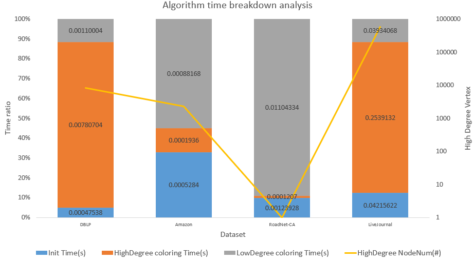
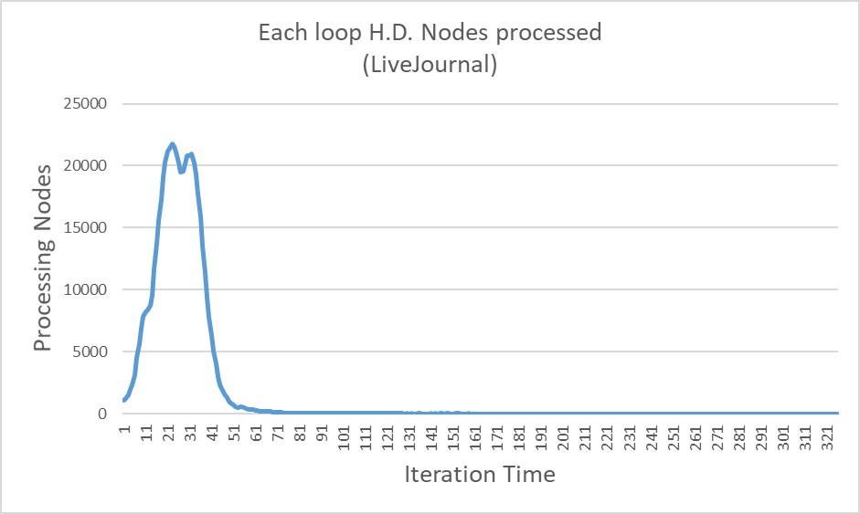

# Parallel Graph Coloring

1. ### [Compile.sh](#compilesh)
2. ### [Parallel Graph Coloring Algorithm](#parallel-graph-coloring-algorithm)
    - [ECL-GC](#ecl-gc)
# Compile.sh
```bash
#if got error after performing compile.sh : permission denied
#go to the folder that contain the compile.sh and use the command below
$ chmod u+x *.sh
```
# Parallel Graph Coloring Algorithm

## ECL-GC

### Experiments


### Reference
1. [paper](https://dl.acm.org/doi/10.1145/3543545)


# Environment
- CPU : Intel(R) Core(TM) i7-4790K CPU @ 4.00GHz
- GPU : GeForce GTX 4060 ti 16G

